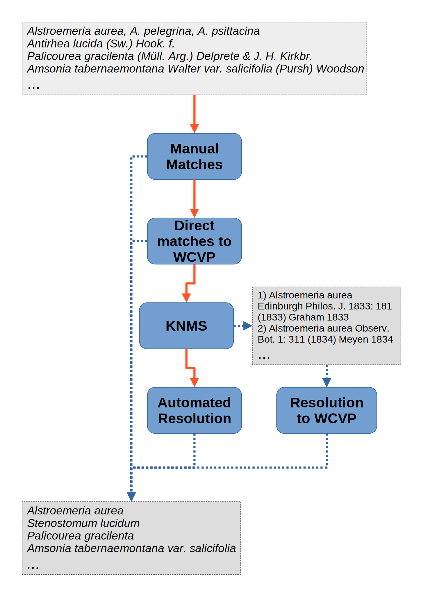

# Standardising Names In Datasets

## Installation

Run:
`pip install git+https://github.com/alrichardbollans/automatchnames.git@1.0`

## Usage

```python
import pandas as pd
from wcvp_name_matching import get_accepted_info_from_names_in_column

data_csv = 'path_to_data.csv'

your_data_df = pd.read_csv(data_csv)  # Data to use
name_col = 'taxa'  # Name of column in data with names to check
# Names of families in your data 
# This is optional, but the program is much faster if specified
# One must be careful with usage of this --- there are some genera that are often considered to be in 
# different families. For example, 'Anthocleista' is an accepted genus in Gentianaceae but is often considered
# to be in Loganiaceae. If you try to match e.g. 'Anthocleista procera' within Loganiaceae it will be unresolved.
# Note however that examples like 'Anthocleista brieyi' are synonyms within Loganiaceae whose accepted family 
# is rubiaceae and in this case the program will find the match
families_in_occurrences = ['Apocynaceae', 'Rubiaceae']
# Manual resolutions are optional and included by specifying a csv file, in the same format as
# the `manual_match_template.csv` file.
manual_resolution_csv = 'manual_match_template.csv'

# Match level specifies how conservative to be. One of ['full', 'direct', 'knms']
# direct: only include direct matches to wcvp
# knms: Include direct matches to wcvp and matches from KNMS
# full: include both of the above, and autoresolution step
match_level = 'full'
data_with_accepted_information = get_accepted_info_from_names_in_column(your_data_df, name_col,
                                                                        families_of_interest=families_in_occurrences,
                                                                        manual_resolution_csv=manual_resolution_csv,
                                                                        match_level=match_level)
```

## Steps

In the first step, to avoid the program spending time trying to find names we know to be problematic we do
some manual matching. Manual resolutions are optional and included by specifying a csv file, in the same
format as the `manual_match_template.csv` file. Tag= 'manual'

Once manual matches have been found, we do some very basic cleaning of submitted names (
see `tidy_names_in_column`method in `string_utils`). We first try to match names directly to taxa in WCVP.
This finds taxa in WCVP which match our submitted names exactly. This tries combinations of just taxon name (
tag= 'direct_wcvp'), taxon name + taxon authors and taxon name + paranthetical authors + primary author (
tags= '
direct_wcvp_w_author'). To better match submitted names containing author information, we also clean the
submitted names by removing spaces after full stops if the full stop isn't part of an infraspecific epithet
and after the space is a letter (see `tidy_authors` method in `string_utils`)

When matching to WCVP, in cases where the there is a single unique match '_unique' is appended to the tags. In
cases where multiple taxa are returned for a given submission, taxa are prioritised based on their status (
i.e. Accepted > Artificial Hybrid > Synonym> Illegitimate>...).

Submitted names which aren't found in these first steps are then matched to names using KNMS, which contains
multiple steps. Firstly, in simple cases where KNMS returns a single match for a submitted name we use the
match IPNI ID to find accepted information from WCVP. Tag = 'knms_unique'

Frequently however, submissions will be matched to multiple names in KNMS. In these cases we attempt to find
the 'best' match. To do this, first we find accepted info for each of the matches using the match IPNI ID and
WCVP. In cases where the accepted name for a given match is the same as the submitted name, we use this
match (Tag = 'knms_multiple_1'). Next, in cases where a given submitted name matches (to many) names which all
have the same accepted name, we use this accepted name (Tag = 'knms_multiple_2').

Next, for submissions which have been matched in KNMS but haven't been resolved so far we look for matches
where the accepted name from the match is contained in the submitted name. This is useful for catching
instances where author names have been provided, meaning that the submission may have been unresolved in the
previous step. In some cases, for a single submitted name this may return multiple matches, in which case we
take the most specific match (i.e. "
Subspecies" > "Variety" > "Species"> "Genus"). Tag = 'knms_multiple_3'

Once we have tried to resolve submitted names through KNMS in the above, we may still have some names left
over. In these cases we first try to do some automated resolution. In this step we search through WCVP for
taxa where the taxon name is contained in the submitted name. This is similar to the previous step but is much
slower as many more names must be checked (specifying families of interest really helps here). For each
submitted name, we then have a list (possibly empty) of taxa where the taxon name is contained in the
submitted name. This list is initially reduced by removing taxa of the same rank but worse taxonomic status
than other taxa in the list (i.e. Accepted > Artificial Hybrid > Synonym> Illegitimate>...). Next, we resolve
by taking the most specific match from this list i.e. "
Subspecies" > "Variety" > "Species"> "Genus". In some cases, a species may be submitted where the species part
of the name has been misspelled e.g. **Neonauclea observifolia**; these cases resolve to the genus which may
or may not be desriable depending on the specific application. Some genera names are shared across family
names (
e.g. **Condylocarpus**). Therefore when families have not been specified, we don't match submissions to genera
where the genera are known to be contained in multiple families. Note that this is conservative and will cause
some good matches to not be matched. Tag= 'autoresolution', including _unique if the match to WCVP was unique

Finally, the resolutions are recompiled and an updated dataframe is returned. Submitted names which haven't
been matched at any point are output to a csv file for you to check. Note that unmatched submissions are
included in the output dataframe without any accepted information.

A rough diagram is given below.



### Notes on outputs

* Output dataframe is the same as the input, with additional columns providing resolved accepted name
  information. Where names are unresolved, values in these columns are empty.
* `matched_by` column specifies how the name has been resolved. One of:
    * 'direct_wcvp(_unique)': name resolved directly matching to WCVP, including _unique if the match to WCVP
      was unique
    * 'direct_wcvp_w_author(_unique)': name resolved directly matching to WCVP including author names,
      including _unique if the match to WCVP was unique
    * 'knms_unique': where KNMS provides a single matching name
    * 'knms_multiple_1': where KNMS provides multiple matches for the submitted name, but the submitted name
      is exactly the same as the accepted name for one of the matches
    * 'knms_multiple_2': where KNMS provides multiple matches for the submitted name, but matches are all
      synonyms of the same accepted name
    * 'knms_multiple_3': where KNMS provides multiple matches for the submitted name, picks matches where the
      accepted name is contained in the submitted name. Where there are multiple such cases, the most specific
      resolutions are picked.
    * 'autoresolution(_unique)': Resolutions found in autoresolution step, including _unique if the match to
      WCVP was unique

## Name Formatting

The program does some automatic formatting of the input to help resolve name, e.g. removing whitespace,
removing unicode characters, fixing capitalisations. However these cleaning method won't catch everything and
may lead to unresolved names, in which case it may be worth checking the input data for:

* Spelling errors
* Infraspecific ranks (var., subsp.) should in general end with '.' e.g. (**Psychotria guadalupensis subsp.
  grosourdieana** not **Psychotria guadalupensis subsp grosourdieana**)
* Authors and publication info should end with '.'

## Notes on KNMS

* KNMS may not return anything if you submit too many names and/or requests. We mitigate this by only checking
  names in KNMS which can't be found in WCVP. Also, results from KNMS are stored for reuse in
  a `name matching temp outputs`
  folder.
* KNMS does not appear to account for spelling errors e.g. 'Neonauclea observifolia' returns no info (it
  should be '
  Neonauclea obversifolia').
* KNMS does not always find matches for correctly spelled accepted names. Some examples are given
  in `knms_unmatched_accepted_names.csv`.
* KNMS does not handle captilisation particularly well. For example, 'PALICOUREA GRACILENTA' is unmatched
  and 'ROTHMANIA ENGLERIANA (K. SCHUM.) KEAV' and 'ROTHMANIA ENGLERIANA (K. Schum) Keav' match the genus '
  Rothmannia Kongl. Vetensk. Acad. Handl. 37: 63 (1776) Thunb. 1776'. Moreover, uncapitalised authors cause no
  matches e.g. 'Acokanthera deflersii schweinf. ex lewin' returns no match.

## Notes on WCVP

* Using most up to date version of WCVP
* Some records in WCVP are not given accepted information e.g. 'Psychotria guadalupensis subsp.
  grosourdieana', '
  Asperula nitida' or '
  Urtica angustifolia'
* Some times POWO and WCVP don't agree (mostly due to short lag in POWO updates?) as of writing **Gunnessia**
  , **Oistonema** and **Gentingia** are accepted in POWO but are synonyms in WCVP
* Accepted names are not always unique (without author information) e.g. **Helichrysum oligocephalum**
* Some taxa are not given ipni ids, including some accepted taxa
* Artificial Hybrids are treated as accepted
* Some taxa are given "nothof." as a rank
* There are some genera that are often considered to be in different families. For example, 'Anthocleista' is
  an accepted genus in Gentianaceae but is often considered to be in Loganiaceae. If you try to match e.g. '
  Anthocleista procera' within Loganiaceae (using `families_of_interest` argument) it will be unresolved. Note
  however that examples like 'Anthocleista brieyi' are synonyms within Loganiaceae whose accepted family is
  rubiaceae and in this case the program will find the match. This is particularly relevant for families like
  Loganiaceae that have been used as a catch-all

## Notes on Kew Reconciliation Service

* KRS relies a little on manually matching unknown samples/multiple matches.
* If we try to include KRS by only including records with single matches, we may still get some errors.
* When doing automatic matching as in `open_reconciling.py` each epithet needs extracting and adding to the
  query otherwise e.g. 'Vaccinium vitis-idaea L.' is matched to its genus '
  Vaccinium L.'
* I've created an implementation which includes KRS but so far it is very slow (possibly because extracting
  epithets for lots of samples is slow).

## Possible Improvements

* See issues.

### Successes and Known Issues

We believe all examples file given in `unit_tests/test_inputs` resolve correctly, with the exception of known
cases in `examples_to_fix.csv`.

## Sources

WCVP (2023). World Checklist of Vascular Plants. Facilitated by the Royal Botanic Gardens, Kew. Published on
the Internet
http://wcvp.science.kew.org/
Retrieved XX/XX/XX.

KNMS (2023). Kew Names Matching Service.
http://namematch.science.kew.org/

[//]: # (Kew Reconciliation Service)

[//]: # ()

[//]: # (gnparser Mozzherin, D.Y., Myltsev, A.A. & Patterson, D.J. “gnparser”: a powerful parser for scientific names)

[//]: # (based on Parsing Expression Grammar. BMC Bioinformatics 18, 279 &#40;2017&#41;)

[//]: # (.https://doi.org/10.1186/s12859-017-1663-3)
